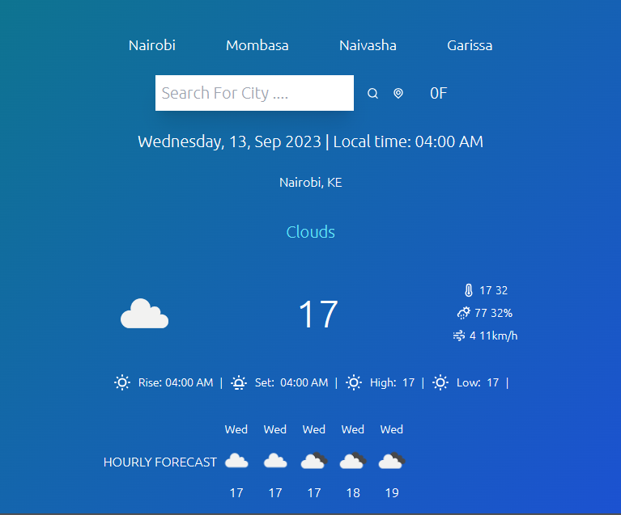

WeatherALX is a one page weather forecasting website that provides hourly and daily forecasts.

# Introduction

Link to deployed site - https://sam-weather-alx.netlify.app
Blog Article -
Author - wanjohiKiboi
LinkedIn - https://www.linkedin.com/in/sammy-wanjohi-kiboi/

# Installation

Create your React app

Open a terminal(Windows Command Prompt or PowerShell).

Create a new project folder: mkdir ReactProjects and enter that directory: cd ReactProjects.

Install React using create-react-app, a tool that installs all of the dependencies to build and run a full React.js application:

PowerShell

Copy
npx create-react-app my-app
yarn create-react-app my-app

# Usage

On an everyday basis, many people use weather forecasts to determine what to wear on a given day. Since outdoor activities are severely curtailed by heavy rain, snow and wind chill, forecasts can be used to plan activities around these events, and to plan ahead and survive them. This website can be used for planning ahead.

# Contributing

I was the sole contributor of the project but got help from @Lydia6470

# Related Projects

https://codingnepalweb.com/demos/weather-app-project-html-javascript/ - Weather Website using HTML CSS and Javascript

https://open-meteo.com/ - Open source weather API for non-commercial use

# Licensing

This project is licensed

# Getting Started with Create React App

This project was bootstrapped with [Create React App](https://github.com/facebook/create-react-app).

## Available Scripts

In the project directory, you can run:

### `yarn start`

Runs the app in the development mode.\
Open [http://localhost:3000](http://localhost:3000) to view it in your browser.

The page will reload when you make changes.\
You may also see any lint errors in the console.

### `yarn test`

Launches the test runner in the interactive watch mode.\
See the section about [running tests](https://facebook.github.io/create-react-app/docs/running-tests) for more information.

### `yarn build`

Builds the app for production to the `build` folder.\
It correctly bundles React in production mode and optimizes the build for the best performance.

The build is minified and the filenames include the hashes.\
Your app is ready to be deployed!

See the section about [deployment](https://facebook.github.io/create-react-app/docs/deployment) for more information.

Screenshot

